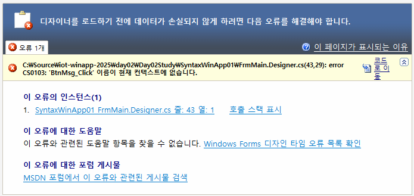
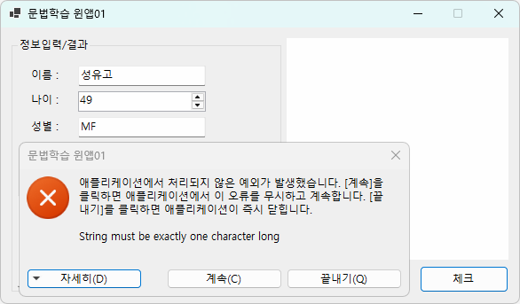

# iot-winapp-2025
IoT 개발자 C#/WinApp 리포지토리 2025

## 1일차

### C# 시작전에
- Visual Studio Installer 확인

    - ASP.NET 및 웹 개발, .NET 데스크톱 개발 필수
    - .NET Multi-Platform App UI 개발
    
    

### C# 학습

#### C#이란?
- C# : **마이크로소프트**가 개발한 객체지향 프로그래밍 언어
    - 1991년, 귀도 반 로섬이 Python을 개발 (1989년 시작)
    - 1985년, 비야네 스트롭스트룹이 C++을 개발(너무 어려움, 1980년 초반 개발시작)
    - 1995년, 제임스 고슬링이 Java를 개발(C++의 문법을 기반, 좀 더 쉬운 언어, 1991년 개발 시작)
    - MS가 썬 마이크로시스템즈와 라이센스 채결 후 MS용 Java인 J++를 개발. 특허권 소송 발생
    - 1999년, 파스칼, 델파이를 개발한 `앤더스 헤일스버그`가 C++, Java를 기반으로 C#을 개발
    - 2000년, C# 발표
    - 2025년, C# 13.0

- C# 특징
    - 닷넷 플랫폼 위에서 동작(Managed C++, C#, Java, Python, ...)
    - 문법이 Java와 상당히 유사. C/C++ 보다 언어 난이도가 낮음
    - Java와 달리 unsafe mode를 사용하면 C/C++ 포인터기능을 사용 가능
    - 런타임 시 쓰레기 수집(**Garbage Collection**)으로 자동 메모리 관리

- C# 유우머
    - 1999년 앤더스 헤일스버그가 최초 이름을 Cool(C-like Object Oriented Language)로 이름을 생성
    - 상표 문제로 C#으로 변경
    - C#의 의미는 C++보다 개선된 언어의 의미로 C++++, 또는 음악에서 #이 원음보다 반음 높다.

- C# 버전
    - C# 1.x(.NET Framework 1.x) - 2002 ~ 2003년, 문제 많음 
    - C# 2.x(.NET Framework 2.x) - 2006년, 개선이 많이 됨
    - C# 3.x(.NET Framework 2.x~3.5) - 2007년, Java와 차이가 많아짐
    - C# 4.x(.NET Framework 4.x) - 2010년, C#의 기반
    - ...
    - C# 6.x(.NET Framework 4.6, .NET Core 1.x) - 2015년
    - C# 7.x(.NET Framework 4.7, .NET Core 2.x) - 2017~2018년
    - ...
    - C# 9.0(.NET 5.0) - 2020년
    - C# 10.0(.NET 6) - 2021년 
    - C# 11.0(.NET 7) - 2022년
    - C# 12.x(.NET 8) - 2023년
    - C# 13.x(.NET 9) - 2024년 11월

- 호환성, 범용성
    - 초기 Windows OS에서만 동작, OS플랫폼 독립적인 Java보다 범용성이 낮았음
    - 2016년 부터 Linux 공식 지원, macOS에서도 사용가능. 오픈소스 공표
    - 유니티 엔진 기본언어, Xamarin(이후 MAUI로 변경)로 모바일 개발 가능
    - 리눅스 Mono라는 닷넷 개발 프로젝트 -> 후에 MS에 흡수됨

#### .NET Framework (.NET)
- CLR(Common Langauage Runtime) 클래스를 사용하는 가상 머신, 예로 C#, Java 동시개발 가능
- Java의 JVM과 유사한 개념
- 언어가 발전하면서 필요한 기능이 늘기 때문에 .NET Framework도 버전업을 계속
- 2016년 리눅스 지원 개발시부터, .NET Framework가 너무 윈도우 구조에 토착되다 보니 새로운 프레임워크가 필요해짐
- .NET Core : 리눅스 지원용으로 만든 .NET Framework 
- .NET Core와 .NET Framework 가 혼용
- 2020년 .NET Core와 .NET Framework를 통합해서 .NET 5.0 공표. 이 이후부터 그냥 .NET으로 불림
- C# 버전과 .NET 버전 숫자 차이나기 시작

- .NET 데스크톱 개발을 설치하면 C#, Visual Basic, F# 등 여러언어를 사용 가능

- C# 12.0, .NET 8 , Visual Studio 2022 Community Edition에서 학습


## 2일차
- WinApp으로 문법 학습, 문법 학습 후 WPF로 이전

### 새 프로젝트 만들기
- 순서
    1. 언어, 플랫폼, 프로젝트 선택
        - 언어 : C# | 플랫폼 : 모든플랫폼 | 프로젝트 : 콘솔, 웹, 데스크톱
    2. 새 프로젝트 구성
        - 프로젝트 이름 , 위치 , 솔루션 이름
        - 솔루션 및 프로젝트를 같은 디렉토리에 배치 체크박스 해제 : 솔루션 내에 여러 프로젝트를 관리
    3. 추가 정보
        - 프레임워크 : .NET 8.0 선택
        - 최상위 문 사용 안함 췤
    4. 스케폴딩 후 IDE 오픈

### 새 프로젝트(데스크톱, WinApp) 만들기
- 아직 멀티플랫폼은 지원 안 됨(Windows 만 지원)
- Window Forms : 가장 오래된 WinApp 개발
- WPF : 좀 더 디자인적으로 뛰어난 WinApp 개발
- 순서
    1. 언어, 플랫폼, 프로젝트 선택
        - 언어 : C# | 플랫폼 : 모든플랫폼 | 프로젝트 : 콘솔, 웹, 데스크톱
    2. Windows Forms 앱 선택 (.NET Framework) 안 적힌것!
    3. 프로젝트명 입력
    4. 추가 정보
        - 프레임워크 : .NET 8.0 선택
        - LTS(Long Term Support) : 개발자가 기능,보안 업데이트 지원, 안정성 높음
        - 프로젝트 구조
        - 종속성 : 필요 모듈 추가, 관리, 삭제
        - Form1.cs : 윈폼 앱 개발 로직
            - Form1.Designer.cs : 실제 디자인 소스
            - Form1.resx : 아이콘, 이미지, 리소스문자열 관리 파일
        - Program.cs : 시작 프로그램 소스

### 솔루션 관리
- 하나의 솔루션에 여러개 프로젝트가 있으면 시작 프로젝트가 선별되어야 함
- 굵은 글씨체로 나오는 프로젝트가 시작 프로젝트
    1. 시작 프로젝트로 변경할 프로젝트 > 마우스 오른쪽 > 시작프로젝트로 설정
    2. 전체 솔루션 > 속성 > 속성페이지
        - 시작 프로젝트 구성 메뉴 > 현재 선택 영역 선택

- 전체 솔루션 : *.sln(전체 솔루션 관리)
    - 프로젝트파일(C#) : *.csproj
    - 프로젝트파일(C++) : *.vcxproj

- debug/release 모드
    - debug : 개발시 사용 모드, 디버깅 로그, 디버깅 위주
    - release : 배포시 사용 모드, 프로그램 최적화, 성능 향상


### WinForm App / WinApp 개발순서
1. Form1.cs 이름 변경 : FrmMain.cs
    - 변경 시 `모든 참조 이름도 바꾸시겠습니까?` 메시지 창, 반드시 예 선택
2. FrmMain.cs [디자인] 클릭 오픈
    - 마우스로 크기 조정
3. 속성 창(F4) 오픈, 솔루션 탐색기 아래쪽 드래그 후 붙이기
4. PyQT Designer와 거의 유사
    - FrmMain 속성 창 > Text > Form1 글자를 변경 후 엔터
    - size 속성 > Width, Height를 직접 수정
    - StartPosition > CenterScreen으로 변경
    - MaximizeBox > False
    - FormBorderStyle > Sizable -> FixedSingle로 변경
5. 보기 > 도구 상자 클릭
    - 공용 컨트롤 > Button 드래그

6. 속성 창 - 드롭다운 컨트롤 클릭 > 여러 클래스 리스트
7. button1 속성 변경
    - (Name) > button1 -> BtnMsg

8. 중간마다 Ctrl + S 저장
9. 속성 창의 이벤트아이콘(번개표시) 클릭
    - Click에 선택 되어 있음
    - 버튼의 경우, 버튼클릭이 기본 이벤트
    - Click 오른쪽 빈 공간을 더블클릭
    - 버튼을 클릭했을 시 처리할 이벤트 메서드가 자동 생성

10. 새로 만든 컨트롤을 더블클릭
    - 이벤트 메서드가 자동 생성
    - 최초에 아무런 이벤트가 없을 때 기본 이벤트 메서드 생성

11. 오류 발생
    - 폼 디자인의 컨트롤 이벤트와 소스코드 상의 이벤트 처리 메서드 생성 상 불일치

    

    - FrmMain.Designer.cs 파일 오픈 후 오류난 이벤트 이름 삭제
    - Windows Form Designer generated code를 확장
    - 오류난 이벤트 이름 삭제

12. MessageBox.show() 작업
    - MessageBoxIcon ... 등 메서드 많음

13. 폼 디자이너 화면과 코드 상 전환
    - F7 , Shift + F7

### 윈앱 컨트롤 1
- `Button` : 마우스 클릭위한 컨트롤
    - 보통 Btn~ 으로 시작
    - (Name) : 소스코드상에서 접근, 사용
    - Enable : 사용여부
    - Location : 폼 상의 위치 (x,y)
    - Size : 버튼 크기 (w,h)
    - TabIndex : 실행 후 탭으로 포커스가 가는 순서(레이블에는 포커스안감)
    - Text : 표기할 텍스트
    - Visible : 화면 표현여부
    - **Click** : 버튼 클릭 이벤트 처리 매핑

- `Label` : 화면상의 글자만 표현하는 컨트롤
    - 보통 Lbl~ 로 시작
    - Button 컨트롤과 동일
    - 이벤트 거의 사용하지 않음

- `TextBox` : 텍스트 입력을 위한 컨트롤
    - 보통 Txt~ 로 시작
    - Button 컨트롤과 동일
    - 이벤트 거의 사용하지 않음
    - MaxLength : 최대 몇자
    - Multiline : 줄 바꿈 사용여부
    - PlaceholderText : 입력 전 입력내용 표시
    - **TextChanged** : 글자가 변경되면 발생하는 이벤트
    - **KeyPress** : 키보드 인터럽트 발생 시 호출되는 이벤트

- `ComboBox` : 목록 보여주고 선택하는 컨트롤
    - Cmb~ || Cbo~
    - Button 컨트롤과 속성은 동일
    - Items(Collection) : 필요한 아이템 할당
    - **SelectionIndexChanged** : 선택한 아이템 순번이 바뀔 때 발생하는 이벤트
    - **SelectedValueChanged** : 선택한 아이템 값이 바뀔 때 발생하는 이벤트 

- `RadioButton` : 크~게~ 레디오를 켜고~
    - 체크박스 느낌의 동그란 체크박스를 제공한다.
         
### C# 문법
- 기초 문법 - C++, Java와 거의 동일
    1. 기본구조 및 주석
        - 네임스페이스, 클래스, 메서드

        ```cs
        namespace ConsoleApp2
        {
            /// <summary>
            /// 프로그램 클래스
            /// </summary>
            internal class Program
            {
                /// <summary>
                /// 주석 - XML 주석. 소스코드 자동 문서 생성시 사용.
                /// </summary>
                /// <param name="args">입력 파라미터</param>
                static void Main(string[] args)
                {
                    //, /**/ :주석
                    Console.WriteLine("Hello, World!!!!");
                    
                }
            }
        }

        ```
    2. 자료형과 변수, Nullable - [소스](./day02/Study/ConsoleApp2/Program.cs)
        - 변수 사용은 C++과 유사
        - 자료형도 C++과 유사, 클래스형은 차이있음
        - 닷넷타입은 여러언어에서 공통으로 사용 위해서 추가된 기능
        추가된 기능
        - Nullabel : 특수타입 , c++ 의 optional 느낌 , ?추가
        - var 타입 : 지역변수에서 타입을 동적으로 지정
            - 지역변수만 가능 (전역 안됨)

    3. 연산자 - [소스](./day02/Study/SyntaxWinApp02/FrmMain.cs)
        - C, C++ 과 동일, 패스!

    4. 분기문, 반복문 - [소스](./day02/Study/SyntaxWinApp03/FrmMain.cs)
        - if문
        - switch문
        - for문
        - foreach는 컬렉션에서...
        - while문

    


## 3일차

### Visual Studio Tip
- 가장 많이 사용할 단축키 : Alt + Enter

### 한글문제
- 콘솔 > Program.cs : UTF8 BOM 저장
- 윈앱 > FrmMain.cs : EUC-KR(CP949) -> 깃헙데스크탑에서 한글이 깨져서 나옴
- VS Code > 오른쪽 하단 상태표시줄 UTF-8 클릭 인코딩하여 다시 열기 또는 저장
- VS > 다른이름으로 저장 > 인코딩하여 저장

- 깃 리포지토리 -> .git -> config
- 맨 윗줄 추가
```ini
[i18n]
    commitEncoding = utf-8
    logOutputEncoding = utf-8
```

### 윈앱 컨트롤 2
- `MaskedTextBox` : 사용자에게 주어진 형태로만 입력을 하도록 강제하는 텍스트 입력컨트롤
    - Txt*
    - Mask : 입력 형식 지정

- `GroupBox` : 컨트롤들 관리할 컨테이너임.
    - 이름을 0.1% 정도 변경

- Button 이미지 추가
    1. 각 폼별 리소스 사용
        - 속성 Image : ... 버튼
        - 리소스 선택 > 로컬 리소스 > 가져오기
    2. 폼 위에 ImageList 컨트롤 사용
        - 도구상자 ImageList 컨트롤 드래그
        - 폼에 표현되는 컨트롤 아님
    3. 전체 리소스에 추가
        - Properties > Resources.resx
        - 속성 Image : ... 버튼
        - 리소스 선택 > 프로젝트 리소스 파일 > 가져오기
    4. Padding 속성
        - Left : 10 정도 지정

- `PictureBox` : 이미지를 표현해주는 컨트롤
    - Pic*

### 윈앱 개발기능
- Debug : 디버깅시 필요한 기능 담은 클래스
    - Debug.WriteLine() : 디버깅 로그 출력 디버그 > 창 > `출력` 에 로그 출력
    - 디버깅 모드에서만 출련
- 프로젝트 속성
    - 출력 유형 : Win 애플리케이션 -> 콘솔 앱으로 변경

### C# 문법
- 기본문법
    5. 문자열 처리 - [소스](./day02/Study/SyntaxWinApp04/FrmMain.cs)
        - 콘솔에서 입력되는 값 -> 모두 문자열
        - WinApp 에서 TextBox에 입력되는 값 -> 모두 문자열
        
    


    6. 클래스와 객체 , 메서드
        - 객체를 정의하는 틀
        - 멤버변수 와 함수(메서드)로 구성
        - Get/Set 

    7. 접근제어자 - [소스](./day03/SyntaxWinApp01/SyntaxWinApp01/Person.cs)
        - private : 클래스 내 접근
        - public : 어디서나 접근
        - protected : 내부, 상속 관계에서 접근
        - internal : 동일 네임스페이스에서 public
        - internal protected : 동일 네임스페이스 protected

        

    8. 상속, 다형성, 추상클래스, 인터페이스 - [소스](./day03/SyntaxWinApp01/SyntaxWinApp02/Computer.cs)
        - Java는 한 파일에 한 클래스 선호
        - C#은 한 파일에 클래스 여러개 생성 무방
        - 상속
            - 부모클래스에 자식객체 할당 가능
        - sealed : 더이상 상속을 하고 싶지 않을 때
        - is, as : 객체 타입을 비교, 형변환 키워드
        - System.Object 모든 클래스의 조상
        - this : 인스턴스 자신을 의미
        - base : 부모클래스를 지칭
        - 다형성, 오버라이드 : 부모 메서드를 재정의
            - 추상 : 대략적인 틀만 가지고 있음
            - 부모메서드는 virtual 키워드
            - 자식메서드는 override 키워드
        - 다형성, 오버로드 : 같은 메서드를 여러번 사용
            - 파라미터 형태와 갯수에 따라 무한대로 같은 이름의 메서드를 생성가능
        - 인터페이스 : 계약관계 정의하고 구현없이 선언만 포함한 클래스의 일종
            - 추상클래스 개선한 방법
            - 추상클래스는 구현을 가질 필요가 없이 하위에서 상속된 자식클래스가 다시 구현하면 됨
            - 문제는 추상클래스도 구현을 가지고 있어서, 혼란이 초래됨.
            - 다중 상속을 하기 위해 씀.
            - 인터페이스는 직접 코딩 말것
            - Alt + Enter 좋누
        
        - 얕은 복사 , 깊은 복사
            - 얕은 복사 : 내부를 같이 참조하는 형태
            - 깊은 복사 : 독립적인 객체

        - ref, out 키워드 > 차후에 ...
        - 열거형

        


## 4일차

### 윈앱 컨트롤 3
- `NumericUpDown` : 숫자 입력을 도와주는 컨트롤.
    - Nud* 이름으로 시작
    - Minimum & Maximum & Value


- `RichTextBox` : 포매팅이 가능한 텍스트박스
    - MS Word, 한글 과 같은 문장 꾸미기, 페이지 꾸미기 등이 가능.
    - ScrollBars
        - Forced
    - WordWrap : 래핑

- `OpenFileDialog` : 읽을 파일 창 컨트롤
    - DlgOpen
    - 코딩으로 설정내용 작성

- `SaveFileDialog` : 저장 파일 창 컨트롤
    - DlgSave
    - 코딩으로 설정내용 작성

- `ColorDialog` : 색상 선택하는 다이얼로그 컨트롤
    - DlgColor
    

- 대부분 컨트롤 속성
    - Anchor : 현 컨트롤의 앵커포인트
    - Dock : 위치 도킹
    - Font : 폰트관련

### VS 개발팁
- 코드조각(Code Snippet)을 최대한 활용(코딩량 줄임, 오타 예방)
- 보기 > 개체브라우저

### C# 문법
- 기본 문법
    9. 형변환
        - 큰 바이트 데이터형에 작은바이트 데이터형 값을 할당하면 문제없이 사용가능(묵시적 형변환)
        - 작은 바이트 데이터형에 큰바이트 데이터형을 할당하면 문법적 오류 -> (명시적 현변환)
        - 명시적 형변환 : 실행중 예외발생은 개발자의 책임이다!
        - 값 타입별 .Parse(string arg) (확실한 값 처리)
        - .TryParse()
        - Convert 클래스 사용 추천 (불확실한 값 처리)
            - Convert.ToInt32()

    9. 예외처리
        - 런타임 에러를 막기위해서
        - try ~ catch ~ finally 구문처리
        - 모든 예외의 부모클래스는 Exception 클래스

        

    10. 컬렉션 - [소스](./day04/Day04Study/SyntaxWinApp02/FrmMain.cs)
        - 배열, 리스트, 딕셔너리, 큐, 스택 등 여러데이터를 저장하고 다루는 구조를 가진 객체를 통칭
        - 배열로 콤보박스에 데이터 할당
        - 리스트로 콤보박스 데이터 할당
        - 딕셔너리로 콤보박스 데이터 할당

        

        
    11. 파일입출력 - [소스](./day04/Day04Study/SyntaxWinApp03/FrmMain.cs)
        - 파일 쓰기, 읽기 기능

        


## 5일차

### C# 문법
- 기본 문법
    12. 델리게이트, 이벤트
    13. 람다식
    14. LINQ
    15. 비동기 
    16. 속성
    17. 제네릭 

## 6일차

### C# 응용 - WPF

## 10일차

### 코딩테스트